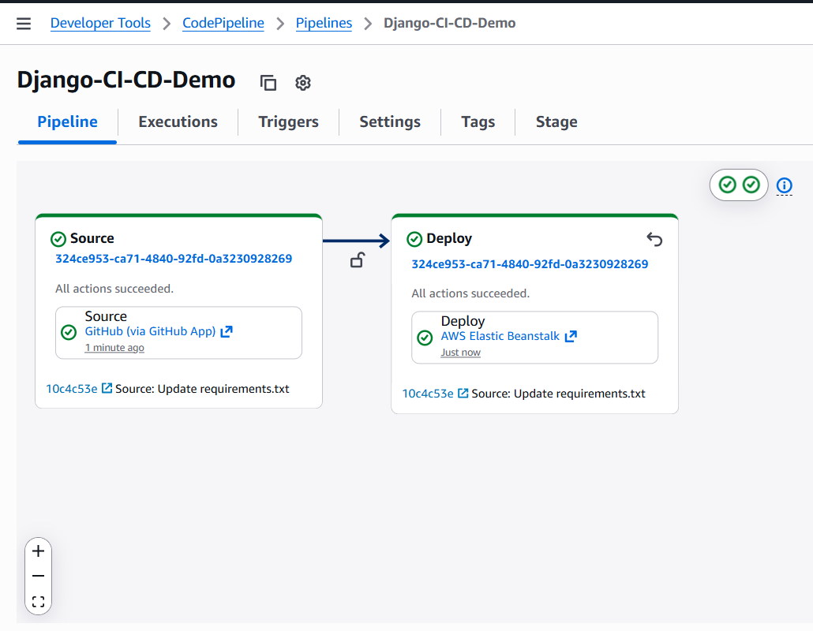
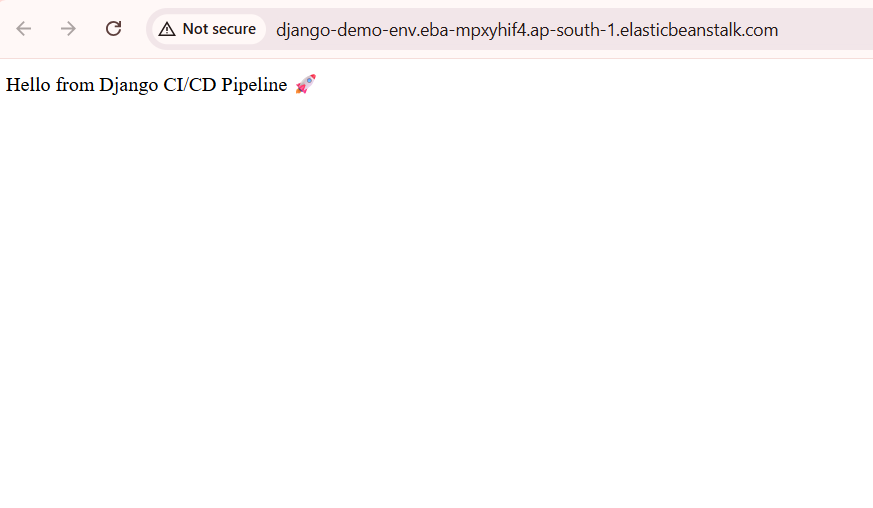
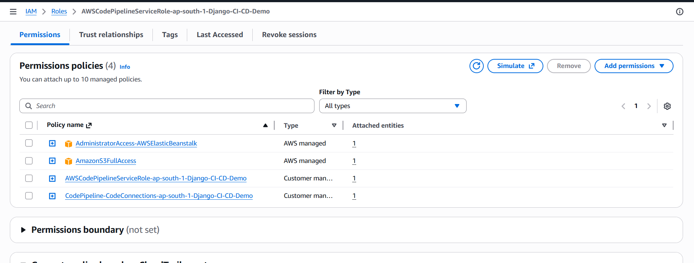
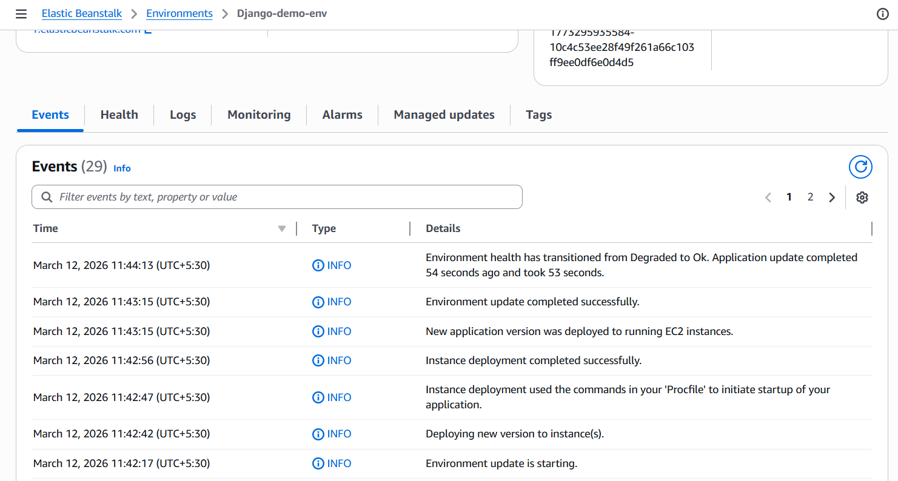

# **Automated Django CI/CD Pipeline on AWS**

## Project Overview
This project demonstrates a complete CI/CD (Continuous Integration/Continuous Deployment) workflow. It automates the deployment of a Django web application from a GitHub repository to AWS Elastic Beanstalk using AWS CodePipeline.

### Status: Successfully Deployed
Technical Note: The AWS resources (Elastic Beanstalk environment and CodePipeline) have been decommissioned to optimize cloud costs. Full execution proof and configuration details are preserved below.

## **Core Technologies**
* **Application:** Python 3.11, Django
* **Web Server:** Gunicorn
* **Hosting:** AWS Elastic Beanstalk (Amazon Linux 2023)
* **Automation:** AWS CodePipeline
* **Integration:** GitHub Marketplace Connector (Version 2)
* **Storage & Security:** Amazon S3, AWS IAM

## **Technical Implementation & Troubleshooting**
* **IAM Configuration:** Resolved initial deployment failures (`Access Denied`) by modifying the CodePipeline service role to include permissions for **S3 Artifacts** and **Elastic Beanstalk Application Versions**.
* **Production Mapping:** Configured a root-level `Procfile` to explicitly define the WSGI entry point for **Gunicorn** on the Amazon Linux 2023 platform.
* **Automation:** Established a webhook-based trigger that automatically initiates the deployment sequence upon every push to the `main` branch.

## **Proof of Deployment**

### **Automated CI/CD Pipeline**

### **Live Django Application**

### **IAM Role Configuration & EB Events**

